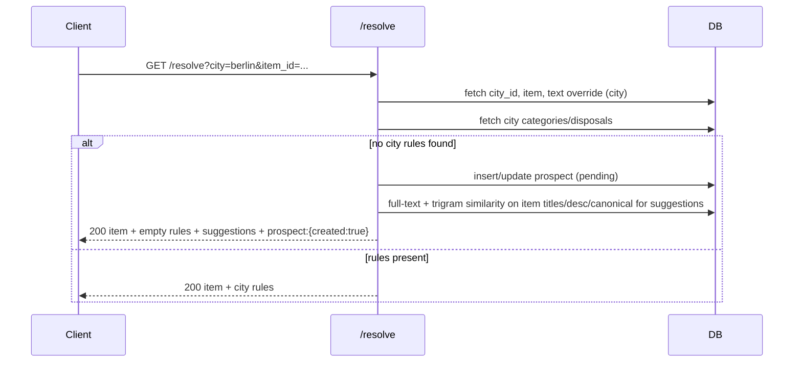
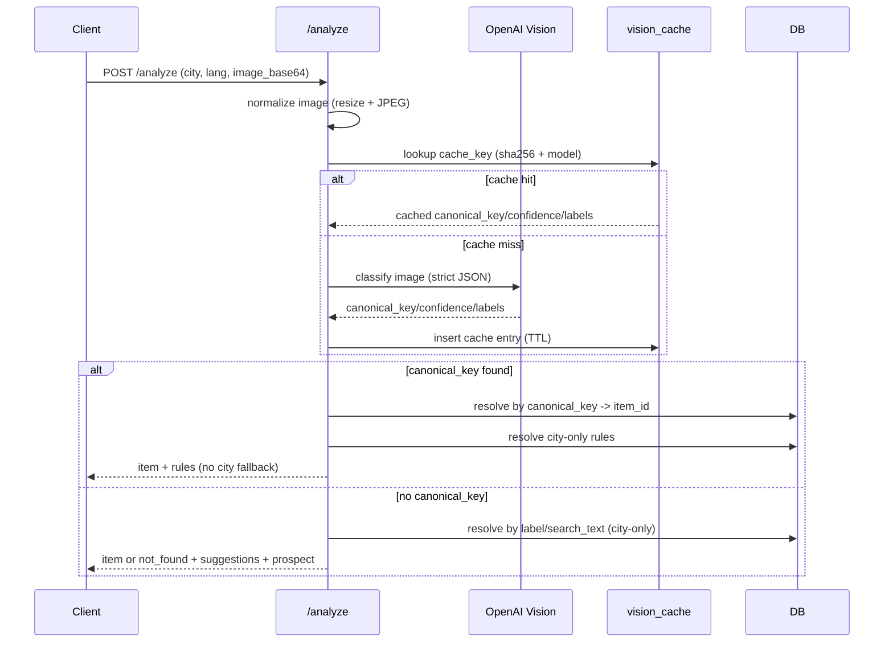

# Architecture & Flows

## High-level
- FastAPI service (`/resolve`) + Postgres (core schema).
- Cities are independent rule sets (no runtime fallback).
- Missing city data triggers: similar-item suggestions + prospect capture for admin review.

## Resolve flow (city-only)

## Analyze flow (image -> resolve)

## Vision cache
- Image is normalized (resize + JPEG) before hashing.
- `cache_key` = sha256(normalized bytes) + ":" + model.
- Cache entries live in `core.vision_cache` with TTL (default 30 days).
- Cache hit returns result without calling OpenAI.

## Prospect lifecycle (admin)
- Created automatically when a city has no rules for the requested item.
- Admin reviews pending prospects, enriches with city-specific categories/disposals/warnings/text, and flips status to approved/rejected.
- Enrichment writes only city-scoped rows (`core.item_city_*`) for that city; other cities remain untouched.

Prospect rules (per city)
- Item not found at all (alias/title/canonical miss): create prospect with `search_text` for that city; return 3 suggestions.
- Item found but city has no rules (categories/disposals empty): create prospect for that city and return 3 city-scoped suggestions.
- Item found and city has rules: no prospect is created.
- Prospects are unique per (item_id, city, lang) or (search_text, city, lang); repeated calls do not duplicate rows.

AI / Vision (MVP)
- /analyze uses base64 image + OpenAI Vision adapter (stub when no API key).
- Stub returns canonical_key=item.battery; real calls should return JSON with canonical_key/confidence/labels/notes.
- If image is invalid base64 -> 400.
- Once canonical_key is resolved, city-only resolver is used; repair/donate placeholders return available=false.

## API contracts (summary)
- `GET /resolve?city={code}&lang={lang}&item_id={uuid}` (or `item_name`):
  - city-only rules; no cross-city fallback.
  - returns item + categories + disposals; if missing -> suggestions + prospect.
- `POST /analyze`:
  - input: city, lang, image_base64 (optional search_text).
  - output: item/rules or not_found + suggestions + prospect + debug.  
